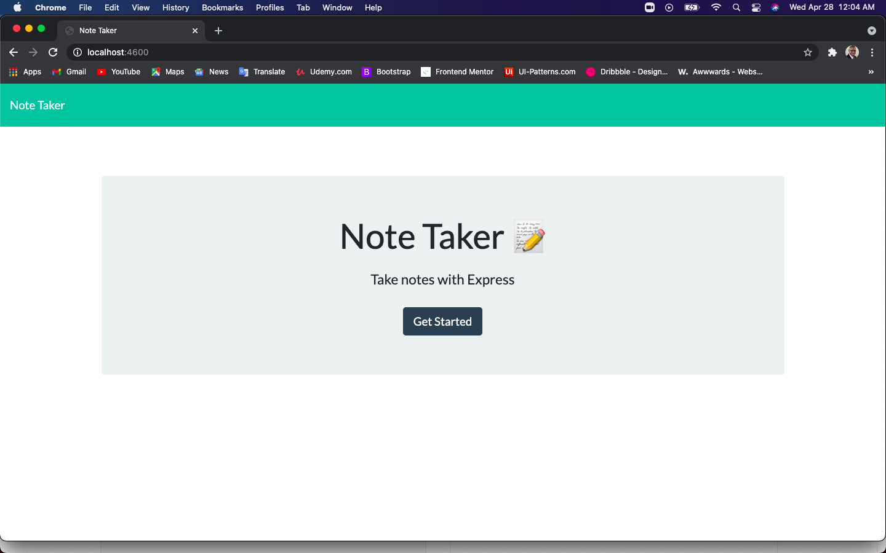
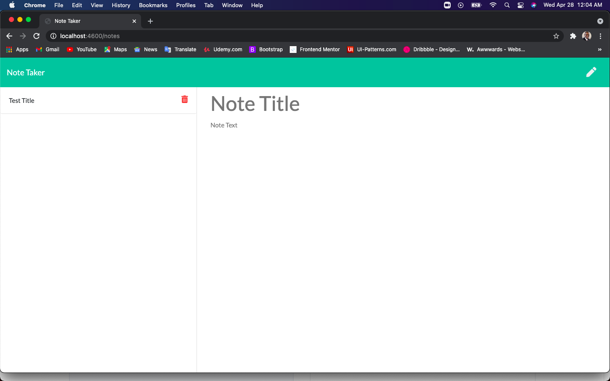
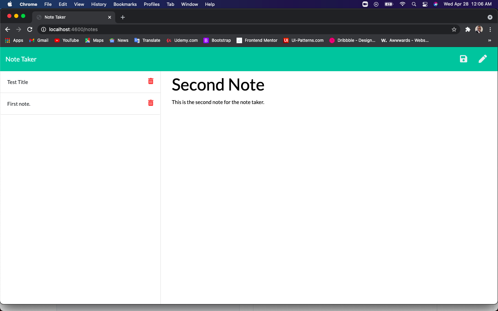
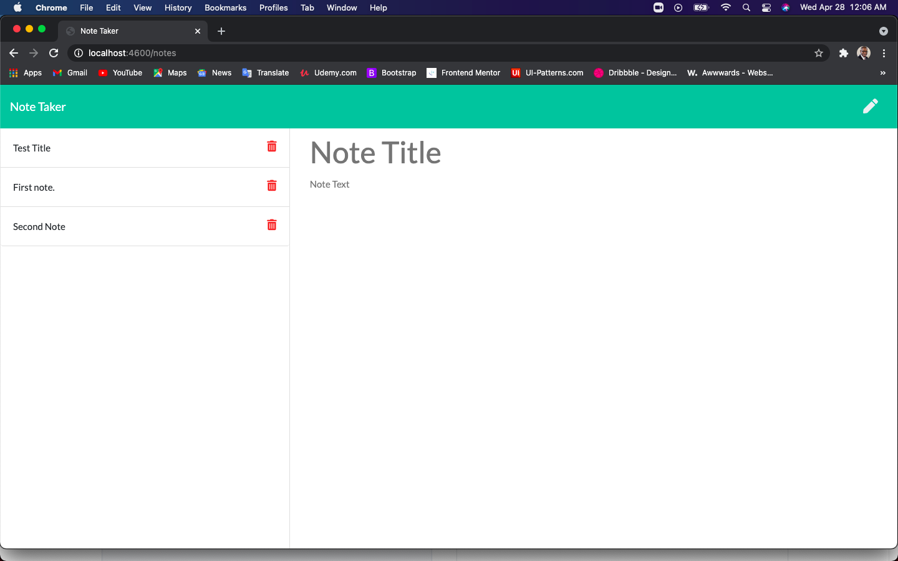

# Note-Taker

* This Note-Taker app will take in text information into the note area and title sections, and can be saved, as well as deleted.

* I used Express.js to write the code for the back-end to be able to connect to the front-end and send and retrieve date from the database.

---

## Use Case

* As a small business owner, you want to be able to write and save notes so that you can organize your thoughts and keep track of tasks that need to be complete.

---

## Get Started

* Below you will see screen shots of how the web application will work.

* You can get started by clicking on the Get Started button, located on the first page of the web app.

* Enter in your note information in the correct note section.
* Enter in your preferred title of your note.

* Click the save icon on the upper right corner of the screen. Your note will appear on the left side of the screen, with a trash can icon in case you wnat to delete your note.

* Have fun and happy note taking!

---

## Note and Link

* This app uses JSON, Express.js, HTML, CSS, & JavaScript to give you a great note taking user experience. This web application is deployed on the Heroku platform and stored on the Github.com platform.

* You can also reach the app using this link to Heroku: [Unique-Note-Taker](https://unique-note-taker.herokuapp.com/)